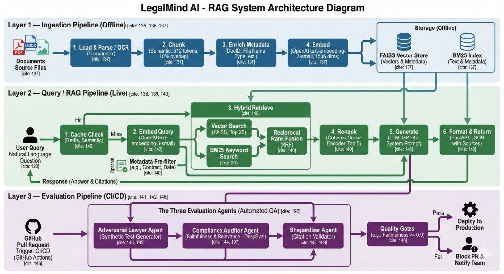

# LegalMind — Law Firm RAG System

## Project Demo

https://github.com/user-attachments/assets/f48b9c1b-03b5-4313-bb8a-76dfcb40db9e

## Architecture Flow Diagram



---

A production-ready **Retrieval-Augmented Generation (RAG)** application for law firms. LegalMind enables legal professionals to query internal documents (contracts, case files, policies) via natural language and receive accurate, source-cited answers grounded in their own knowledge base.

---

## Overview

LegalMind combines **hybrid search** (vector + keyword), **optional neural reranking**, **semantic caching**, and **structured LLM output** to deliver a robust, low-latency Q&A experience. The system is designed for domain-specific legal retrieval with strict source attribution and evaluation-driven quality assurance.

---

## Tech Stack

### Backend
| Layer | Technology |
|-------|------------|
| **API** | FastAPI, Uvicorn |
| **LLM** | OpenAI GPT-4o-mini (via LangChain) |
| **Embeddings** | OpenAI `text-embedding-3-small` |
| **Vector Store** | FAISS (via LlamaIndex) |
| **Keyword Search** | BM25 (rank-bm25) |
| **Reranking** | Cohere Rerank API (optional) |
| **Cache** | Redis (semantic similarity cache) |
| **Document Processing** | LlamaIndex (SimpleDirectoryReader, SentenceSplitter), PyPDF, python-docx |
| **Validation** | Pydantic, Pydantic Settings |

### Frontend
| Layer | Technology |
|-------|------------|
| **Framework** | React 18 |
| **Build Tool** | Vite 5 |
| **Styling** | Tailwind CSS |
| **Language** | TypeScript |

### Evaluation & Testing
| Layer | Technology |
|-------|------------|
| **Metrics** | DeepEval (Faithfulness, Answer Relevancy, Contextual Precision) |
| **Testing** | pytest, pytest-asyncio |
| **Quality Checks** | Citation validation, golden dataset regression tests |

---

## Architecture

```
┌─────────────┐     ┌──────────────────────────────────────────────────────────┐
│   React     │     │                     FastAPI Backend                       │
│   (Vite)    │────▶│  /query  ──▶  Redis Cache  ──▶  (hit) return cached      │
└─────────────┘     │               (miss)                                     │
                    │                    │                                     │
                    │                    ▼                                     │
                    │   Hybrid Retrieval: FAISS + BM25 → RRF fusion            │
                    │                    │                                     │
                    │                    ▼                                     │
                    │   Optional Cohere Rerank  ──▶  top-k chunks              │
                    │                    │                                     │
                    │                    ▼                                     │
                    │   LangChain + OpenAI (structured: answer + sources_used) │
                    │                    │                                     │
                    │                    ▼                                     │
                    │   Validate citations  ──▶  save to cache  ──▶  response  │
                    └──────────────────────────────────────────────────────────┘
```

### Pipeline Summary

1. **Ingestion**: Load PDF, DOCX, TXT → chunk (sentence-aware) → embed → build FAISS + BM25 indexes.
2. **Retrieval**: Vector search + BM25 → Reciprocal Rank Fusion (RRF) for hybrid ranking.
3. **Reranking**: Optional Cohere rerank to refine top candidates.
4. **Generation**: LangChain chain with structured output (`answer`, `sources_used`), strict prompt to cite only provided context.
5. **Cache**: Semantic cache in Redis; identical/similar questions return cached answers. Fallback “no info” answers are not cached.

---

## Project Structure

```
law_firm_rag_system/
├── backend/
│   ├── api/           # FastAPI routes, schemas, dependencies
│   ├── core/          # Config, embeddings, LLMs, vector stores, logging
│   ├── generation/    # RAG chain, prompts, semantic cache
│   ├── ingestion/     # Loader, chunker, indexer (FAISS, BM25)
│   ├── retrieval/     # Vector/BM25 search, fusion, reranker, assets
│   ├── evaluation/    # DeepEval integration, citation checks, test generator
│   └── scripts/       # run_ingestion, clear_cache
├── frontend/          # React + Vite + Tailwind chat UI
├── documents/         # Source documents (PDF, DOCX, TXT)
├── storage/           # FAISS index, BM25, nodes, manifest (generated)
└── tests/             # pytest, RAG quality tests
```

---

## Features

- **Hybrid search**: Combines dense (vector) and sparse (BM25) retrieval with RRF.
- **Source attribution**: LLM returns only cited documents; API validates against retrieved chunks.
- **Semantic caching**: Reduces latency and API cost for repeated or similar queries.
- **Document type filtering**: Optional `doc_type` filter (e.g. `contract`, `case_file`).
- **Debug mode**: Returns retrieved chunks in response for inspection.
- **Evaluation**: DeepEval metrics and citation checks to prevent quality regressions.

---

## Getting Started

### Prerequisites

- Python 3.10+
- Node.js 18+
- Redis (for semantic cache)
- OpenAI API key

### Backend

```bash
# From project root
pip install -r requirements.txt
cp .env.sample .env   # set OPENAI_API_KEY, COHERE_API_KEY (optional), REDIS_URL

# Ingest documents
python -m backend.scripts.run_ingestion

# Start API
uvicorn backend.api.main:app --reload --port 8000
```

### Frontend

```bash
cd frontend
npm install
npm run dev
```

Open `http://localhost:5173` for the chat UI; API at `http://localhost:8000`.

### Environment Variables

| Variable | Description |
|----------|-------------|
| `OPENAI_API_KEY` | Required for embeddings and LLM |
| `COHERE_API_KEY` | Optional; used for reranking (set `USE_COHERE_RERANK=false` for trial keys) |
| `REDIS_URL` | Default `redis://localhost:6379` |
| `DOCUMENTS_DIR` | Path to PDF/DOCX/TXT docs (default `./documents`) |
| `STORAGE_DIR` | Output for indexes (default `./storage`) |

### Clear Cache

If the semantic cache returns stale or incorrect answers:

```bash
python -m backend.scripts.clear_cache
```

---

## API

**POST** `/query`

```json
{
  "question": "What are the termination clauses in the contract?",
  "doc_type": "contract",
  "debug": false
}
```

Response:

```json
{
  "answer": "...",
  "sources": ["contract.pdf"],
  "cache_hit": false,
  "debug": null
}
```

---

## Evaluation

Run RAG quality tests (requires API running):

```bash
pytest tests/test_rag_quality.py -v
```

Uses DeepEval (Faithfulness, Answer Relevancy, Contextual Precision) and citation validation against a golden dataset.

---

## License

Private / Portfolio project.
